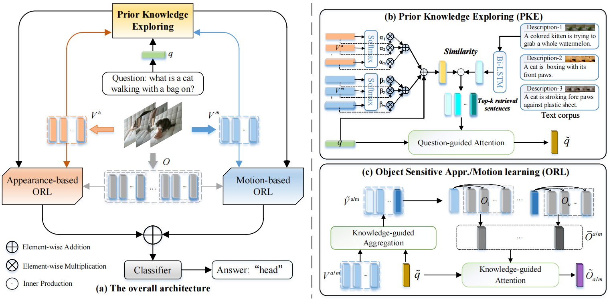

<div align="center">
<h1>
<b>
Video Question Answering with Prior Knowledge and Object-sensitive Learning
</b>
</h1>
<h4>
<b>
<a href="https://ppengzeng.github.io/">Pengpeng Zeng</a>, <a href="https://github.com/zchoi">Haonan Zhang</a>, <a href="https://lianligao.github.io/">Lianli Gao</a>, <a href="https://cfm.uestc.edu.cn/~songjingkuan/">Jingkuan Song</a>, <a href="https://scholar.google.com.hk/citations?user=krryaDkAAAAJ&hl=zh-CN">Heng Tao Shen</a>
</b>
</h4>

[Paper](https://ieeexplore.ieee.org/stamp/stamp.jsp?tp=&arnumber=9882977) | **TIP 2022**
</div>

<p align="center">
  <br>
  <span><b>Figure 1. Overview of the proposed PKOL architecture for video question answering. </b></span>
</p>


## Table of Contents

- [Setups](#setups)
- [Data Preparation](#data-preparation)
- [Training](#experiments)
- [Evaluation](#experiments)
- [Reference and Citation](#reference)
- [Acknowledgements](#acknowledgements)

## Setups

- **Ubuntu** 20.04
- **CUDA** 11.5
- **Python** 3.7
- **PyTorch** 1.7.0 + cu110

1. Clone this repository：

```
git clone https://github.com/zchoi/PKOL.git
```

2. Install dependencies：

```
conda create -n vqa python=3.7
conda activate vqa
pip install -r requirements.txt
```
## Data Preparation

- ### Text Features

  Download pre-extracted text features from [here](https://pan.baidu.com/s/16fZOtIe6rtR4SW-G1Cc2zA?pwd=zca5) (code: zca5), and place it into `data/{dataset}-qa/` for MSVD-QA, MSRVTT-QA and `data/tgif-qa/{question_type}/` for TGIF-QA, respectively.

- ### Visual Features
  - For appearance and motion features, we used this [repo](https://github.com/thaolmk54/hcrn-videoqa) [1].

  - For object features, we used the Faster R-CNN [2] pre-trained with Visual Genome [3].

  Download pre-extracted visual features from [here](https://pan.baidu.com/s/16fZOtIe6rtR4SW-G1Cc2zA?pwd=zca5) (code: zca5), and place it into `data/{dataset}-qa/` for MSVD-QA, MSRVTT-QA and `data/tgif-qa/{question_type}/` for TGIF-QA, respectively.

> **Note:** The object features are huge, (especially ~700GB for TGIF-QA), please be cautious of disk space when downloading.

## Experiments

###  For MSVD-QA and MSRVTT-QA：

<u>Training</u>：

```
python train_iterative.py --cfg configs/msvd_qa.yml
```
<u>Evaluation</u>：

```
python validate_iterative.py --cfg configs/msvd_qa.yml
```
###  For TGIF-QA：

  Choose a suitable config file in `configs/{task}.yml` for one of 4 tasks: `action, transition, count, frameqa` to train/val the model. For example, to train with action task, run the following command:

<u>Training</u>：

```
python train_iterative.py --cfg configs/tgif_qa_action.yml
```

<u>Evaluation</u>：

```
python validate_iterative.py --cfg configs/tgif_qa_action.yml
```
## Results

Performance on MSVD-QA and MSRVTT-QA datasets:

| Model   | MSVD-QA | MSRVTT-QA |
|:----------  |:-------:  |:-:  |
| PKOL |    41.1    | 36.9 |

Performance on TGIF-QA dataset:

| Model | Count ↓ | FrameQA ↑ | Trans. ↑ | Action ↑ |
| :---- | :-----: | :-------: | :------: | :------: |
| PKOL  |  3.67   |   61.8    |   82.8   |   74.6   |

## Reference
[1] Le, Thao Minh, et al. "Hierarchical conditional relation networks for video question answering." Proceedings of the IEEE/CVF conference on computer vision and pattern recognition. 2020.

[2] Ren, Shaoqing, et al. "Faster r-cnn: Towards real-time object detection with region proposal networks." Advances in neural information processing systems 28 (2015).

[3] Krishna, Ranjay, et al. "Visual genome: Connecting language and vision using crowdsourced dense image annotations." International journal of computer vision 123.1 (2017): 32-73.

## Citation
```bibtex
@article{PKOL,
  title   = {Video Question Answering with Prior Knowledge and Object-sensitive Learning},
  author  = {Pengpeng Zeng and 
             Haonan Zhang and 
             Lianli Gao and 
             Jingkuan Song and 
             Heng Tao Shen
             },
  journal = {IEEE Transactions on Image Processing},
  doi     = {10.1109/TIP.2022.3205212},
  pages   = {5936--5948}
  year    = {2022}
}
```
## Acknowledgements
Our code implementation is based on this [repo](https://github.com/thaolmk54/hcrn-videoqa).
